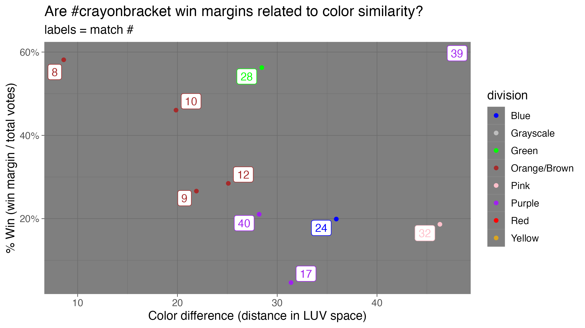

# Analysis of #crayonbracket

<!-- badges: start -->

<!-- badges: end -->

[#crayonbracket](<https://twitter.com/hashtag/crayonbracket>) is a bracket style tournament on Twitter organized by [@sbarolo](<https://twitter.com/sbarolo>).
I used the [`rtweet`](https://docs.ropensci.org/rtweet/) and [`httr`](https://httr.r-lib.org/) R packages to access the Twitter poll results for each match-up and pulled the vote totals for each color as well as the hex codes for the color.
I then used the [`colorspace`](http://colorspace.r-forge.r-project.org/) R package to convert the hex codes into the LUV color space.

Code in `get_tweet_data.R` accesses the Twitter API to get the data (you'll need a bearer token for this to run on your machine).

Code in `color_distance.R` takes that data, does some color space transformations, and makes a plot.

Cleaned data is provided in the `data/` folder

## Does color difference affect win margin?

In other words, if two colors are very perceptually different, does the winning color win by more votes?

(more to come...)

## Contributing

If you know more about human color perception or crayons than I do and want to play around with these data, please feel free to make a pull request, open an issue, or tweet at me.
