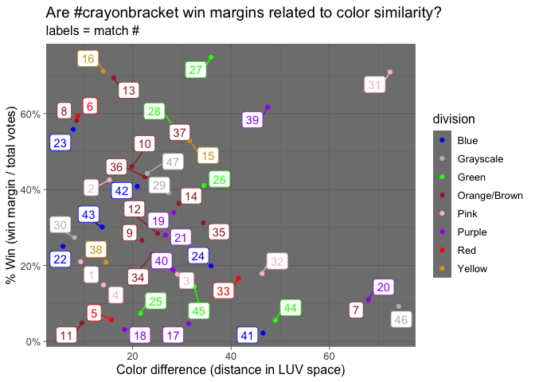
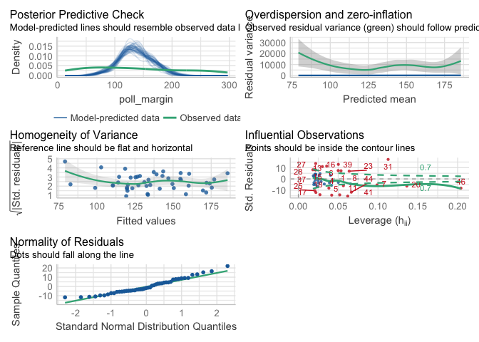
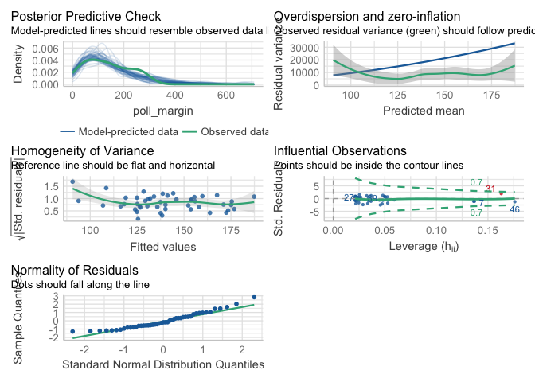

Color Analysis
================
Eric R. Scott
2022-10-07

``` r
# Load packages and data --------------------------------------------------
library(colorspace)
library(tidyverse)
```

    ## ── Attaching packages ─────────────────────────────────────── tidyverse 1.3.2 ──
    ## ✔ ggplot2 3.3.6      ✔ purrr   0.3.5 
    ## ✔ tibble  3.1.8      ✔ dplyr   1.0.10
    ## ✔ tidyr   1.2.1      ✔ stringr 1.4.1 
    ## ✔ readr   2.1.3      ✔ forcats 0.5.2 
    ## ── Conflicts ────────────────────────────────────────── tidyverse_conflicts() ──
    ## ✖ dplyr::filter() masks stats::filter()
    ## ✖ dplyr::lag()    masks stats::lag()

``` r
library(ggrepel)
library(performance)
```

    ## Warning: package 'performance' was built under R version 4.2.1

``` r
library(MASS)
```

    ## 
    ## Attaching package: 'MASS'
    ## 
    ## The following object is masked from 'package:dplyr':
    ## 
    ##     select

``` r
library(car)
```

    ## Loading required package: carData
    ## 
    ## Attaching package: 'car'
    ## 
    ## The following object is masked from 'package:dplyr':
    ## 
    ##     recode
    ## 
    ## The following object is masked from 'package:purrr':
    ## 
    ##     some

``` r
full_data <- read_csv("data/crayonbracket.csv")
```

    ## Rows: 94 Columns: 9
    ## ── Column specification ────────────────────────────────────────────────────────
    ## Delimiter: ","
    ## chr (4): colors, label, color_name, division
    ## dbl (5): match, id_str, poll_id, position, votes
    ## 
    ## ℹ Use `spec()` to retrieve the full column specification for this data.
    ## ℹ Specify the column types or set `show_col_types = FALSE` to quiet this message.

# Is the difference between colors a main driver of how close a match is?

In other words, do colors that are more different from eachother have a
winner that wins by a greater number of votes?

To understand this, first we need a metric of how different or similar
colors are. I pulled the hex codes for each crayon color from @sbarolo’s
tweets (assuming they are accurate and official Crayola hex colors). I
then transformed them to the LUV color space, which is relatively
“percepturally uniform” meaning that we can use the Euclidean distance
between colors in this space as a measure of similarity.

``` r
#Create matrix column of HSV coordinates for each color
dist_diff <- 
  full_data |>
  mutate(coords = colors |> hex2RGB() |> as("LUV") |> coords()) |> 
  #For each match ...
  group_by(match) |> 
  #Use the matrix to calculate euclidean distance
  summarise(
    distance = as.numeric(dist(coords, method = "euclidean")), #color similarity
    poll_margin = abs(diff(votes)), #how many votes did the winner win by?
    winner = color_name[which.max(votes)], #which color won?
    total_votes = sum(votes), #how many total votes?
    division = unique(division), #what division were they in?
    match_name = glue::glue_collapse(color_name, sep = " vs. ")
  ) |> 
  mutate(margin_prop = poll_margin/total_votes) |> #percentage win margin
  dplyr::select(match, match_name, winner, division, poll_margin, total_votes, margin_prop, distance)
head(dist_diff)
```

    ## # A tibble: 6 × 8
    ##   match match_name                winner divis…¹ poll_…² total…³ margi…⁴ dista…⁵
    ##   <dbl> <glue>                    <chr>  <chr>     <dbl>   <dbl>   <dbl>   <dbl>
    ## 1     1 lavender vs. carnation p… carna… Pink        101     481  0.210     9.43
    ## 2     2 violet red vs. wild stra… wild … Pink        219     515  0.425    15.3 
    ## 3     3 magenta vs. tickle me pi… magen… Pink         70     396  0.177    29.1 
    ## 4     4 mauvelous vs. salmon      mauve… Pink         67     451  0.149    14.1 
    ## 5     5 scarlet vs. red           red    Red          31     547  0.0567   15.6 
    ## 6     6 brick red vs. mahogany    brick… Red         243     409  0.594     8.86
    ## # … with abbreviated variable names ¹​division, ²​poll_margin, ³​total_votes,
    ## #   ⁴​margin_prop, ⁵​distance

Then we can plot these data:

``` r
#manual color scale for division
division_color <- 
  c(Blue = "blue", Grayscale = "grey", Green = "green", `Orange/Brown` = "brown", Pink = "pink", Purple = "purple", Red = "red", Yellow = "goldenrod")

ggplot(dist_diff, aes(x = distance, y = margin_prop, color = division)) + 
  geom_point() +
  geom_label_repel(aes(label = match), show.legend = FALSE) +
  # geom_label(aes(label = match)) +
  scale_color_manual(values = division_color) +
  scale_y_continuous(labels = scales::percent) +
  labs(title = "Are #crayonbracket win margins related to color similarity?",
       subtitle = "labels = match #",
       x = "Color difference (distance in LUV space)",
       y = "% Win (win margin / total votes)") +
  theme_dark() +
  theme(text = element_text(size = 12))
```

<!-- -->

``` r
ggsave("color_diff_vs_win_margin.png", width = 1200*2, height = 675*2, unit = "px")
```

It doesn’t look like there is any particularly strong pattern, but let’s
fit a model.

Votes are a count variable, so maybe they’re Poisson distributed? I’m
going to go with a Poisson GLM and use an offset of total votes to
account for variation in “sampling effort”

``` r
m <- 
  glm(poll_margin ~ distance,
      family = poisson,
      offset = log(total_votes),
      data = dist_diff)
performance::check_overdispersion(m)
```

    ## # Overdispersion test
    ## 
    ##        dispersion ratio =   63.635
    ##   Pearson's Chi-Squared = 2863.594
    ##                 p-value =  < 0.001

    ## Overdispersion detected.

``` r
performance::check_model(m)
```

<!-- -->

There’s overdispersion, so let’s try a negative binomial model.

``` r
m2 <- 
  glm.nb(poll_margin ~ distance + offset(log(total_votes)),
         data = dist_diff)
performance::check_model(m2)
```

<!-- -->

Looks much better

``` r
Anova(m2)
```

    ## Analysis of Deviance Table (Type II tests)
    ## 
    ## Response: poll_margin
    ##          LR Chisq Df Pr(>Chisq)
    ## distance  0.89068  1     0.3453

Not significant! So no relationship (so far) between win margin and
color similarity

# Question 2: Is number of votes related to saturation?

I think people just like more saturated colors. What is saturation and
how is it represented in color space?
